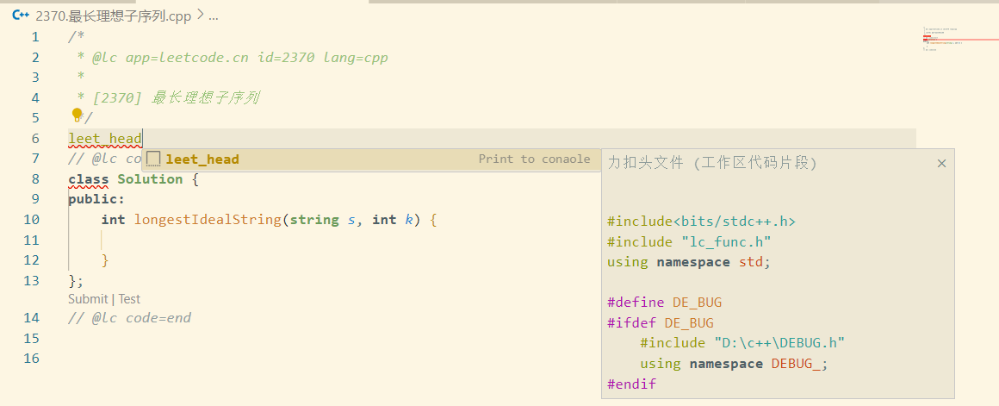
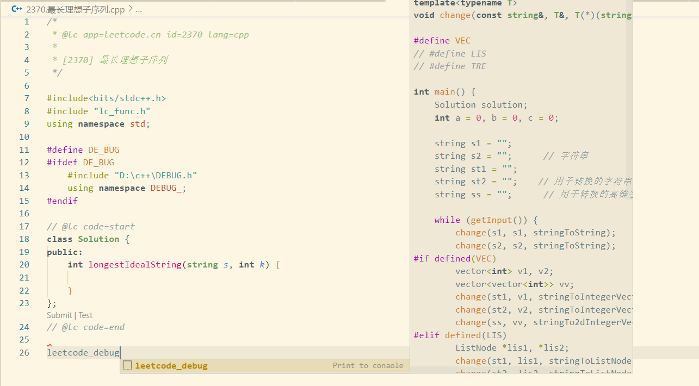

# LeetCode Easy Debug

本项目提供一种在 VSCode 调试 LeetCode C++ 代码的方案，需要用到的工具如下：

- VSCode
- VSCode `LeetCode` 官方插件
- VSCode `Competitive Programming Helper (cph)` 插件

本项目使用C++17标准，请在编译时添加 `-std=c++17` 参数。

在 VSCode 中配置 C++17 可以参考 [Windows Vscode C++17/20 配置教程_NEFU AB-IN的博客-CSDN博客](https://blog.csdn.net/qq_45859188/article/details/120678430)


## 项目介绍

### DEBUG.h

本项目通过 `DEBUG.h` 来实现调试功能。在该文件中，重载了常见数据结构的流插入操作符(<<)，并实现了可变参数宏 `debug(...)` ，能输出传入参数的相关信息。目前能实现的功能有：

- 通过 `debug` 宏打印基本类型变量/常量的值
- 通过 `debug` 宏打印 `pair` 
- 通过 `debug` 宏打印 `tuple` 
- 通过 `debug` 宏打印数组
- 通过 `debug` 宏打印 STL 容器
- 通过 `debug` 宏打印 STL 容器适配器 (stack, queue, priority_queue)
- 通过修改 `SEP` 参数来修改各参数间的分隔符号 (默认为两个空格 `"  "`)
- 通过修改 `OUTPUT` 参数来修改输出流对象 (默认为 `std::cerr` )
- 通过修改 `NEWLINE` 参数来控制是否在每个对象输出后换行 (一般用于对于 LeetCode 中二叉树的输出，默认为 `false` )

基本使用方法如下：

```c++
/* 省略其他头文件 */
#define DE_BUG
#include "DEBUG.h"
using namespace DEBUG_;

int main() {
	int a[]{0, 1, 2, 3};	// 数组类型
    char c[] = "abc";		// c字符串类型
    string s = "xyz";		// string类型
    vector<double> v{3.14159, 2.71828};		// vector类型
    map<int, map<char, int>> DFA = {
        {1, {{'a', 2}, {'b', 3}}},
        {2, {{'a', 4}, {'b', 3}}},
        {3, {{'a', 2}, {'b', 5}}},
        {4, {{'a', 4}, {'b', 5}}},
        {5, {{'a', 4}, {'b', 5}}},
    };	// 复合类型
	stack<char> st; st.push('+'); st.push('*'); st.push('%');	// 栈类型
    queue<int> q; q.push(1); q.push(2); q.push(3);		// 队列类型
    priority_queue<int> pq; pq.push(10); pq.push(3); pq.push(13);	// 优先队列类型
    pair<int, int> p{3, 4};	// pair类型
    tuple<int, double, string> t{1, 2.0, "3"};	// tuple类型
    #ifdef DE_BUG
        debug(a, c, s, v)  // 输出：a = [0,1,2,3];  c = abc;  s = xyz;  v = [3.14159,2.71828]
        debug(DFA)  // 输出：DFA = {<1:{<a:2>,<b:3>}>,<2:{<a:4>,<b:3>}>,<3:{<a:2>,<b:5>}>,<4:{<a:4>,<b:5>}>,<5:{<a:4>,<b:5>}>}
        SEP = "\n";  // 修改输出间隔符
        debug(st, q, pq)  // 输出：st = {+,*,%}; \n {1,2,3}; \n pq = [13,3,10]
        debug(p, t)  // 输出：p = <3:4>; \n t = <1,2,3>
    #endif
    auto add = [](int a, int b) { return a+b; };
    #ifdef DE_BUG
        SEP = "  "; // 复原输出间隔符
        // ! 注意：debug内若有多参数函数，函数内的参数间不能存在空格
        debug(add(2,8), add(3,7))   // 输出：add(2,8) = 10;  add(3,7) = 10
    #endif
}
```

更多细节详看文件 `DEBUG.h` 

如果不满意显示效果，可修改 `DEBUG.h` 文件实现自定义的输出格式。


### lc_func.h

该文件中包含了一些常用的 LeetCode 函数，包括但不限于：

- `vector<int> stringToIntegerVector(string)` 将字符串转换为vector
- `vector<vector<int>> stringTo2dIntegerVector(string)` 将字符串转换为二维vector
- `ListNode* stringToListNode(string)` 将字符串转换为链表
- `TreeNode* stringToTreeNode(string)` 将字符串转换成二叉树

在该文件中还重载了 `<<` 操作符，使得能够直接输出链表和二叉树。能配合 `DEBUG.h` 中的 `debug` 宏使用，实现链表和二叉树的调试输出。

文件还实现了函数 `bool getInput(...)` 能够从标准输入中读取 LeetCode 的输入格式，方便本地调试。


### leet_head.code-snippets

该文件是一个代码片段，能够快速生成 LeetCode 代码的头部，生成的内容如下：

```c++
#include<bits/stdc++.h>
#include "lc_func.h"
using namespace std;

#define DE_BUG
#ifdef DE_BUG
    #include "DEBUG.h"
    using namespace DEBUG_;
#endif
```


### DEBUG.code-snippets

该文件是一个代码片段，能够快速生成调试代码的相关格式，生成的内容如下：

```c++
#ifdef DE_BUG
    debug()
#endif
```


### leetcode_debug.code-snippets

该文件是一个代码片段，能为 LeetCode 代码快速生成调试的主函数部分，生成的内容如下：

```c++
template<typename T>
void change(const string&, T&, T(*)(string));

#define VEC
// #define LIS
// #define TRE

int main() {
    Solution solution;
    int a = 0, b = 0, c = 0;

    string s1 = "";
    string s2 = "";	 // 字符串
    string st1 = "";
    string st2 = "";	// 用于转换的字符串
    string ss = "";	 // 用于转换的高维字符串

    while (getInput()) {
        change(s1, s1, stringToString);
        change(s2, s2, stringToString);
#if defined(VEC)
        vector<int> v1, v2;
        vector<vector<int>> vv;
        change(st1, v1, stringToIntegerVector);
        change(st2, v2, stringToIntegerVector);
        change(ss, vv, stringTo2dIntegerVector);
#elif defined(LIS)
        ListNode *lis1, *lis2;
        change(st1, lis1, stringToListNode);
        change(st2, lis2, stringToListNode);
#elif defined(TRE)
        TreeNode *root1, *root2;
        change(st1, root1, stringToTreeNode);
        change(st2, root2, stringToTreeNode);
#endif
        
#ifdef DE_BUG
        auto ans = solution.();
        OUTPUT = &cout;
        debug(ans)
        OUTPUT = &cerr;
#endif
    }
}

template<typename T>
void change(const string &s, T &v, T(*func)(string)) {
    try {
        v = func(s);
    } catch (const exception& e) {
        // cerr << e.what() << endl;
    }
}
```

该代码片段已给出大部分 leetcode 题目的调试格式，若题目是关于链表的，只需要注释`#define VEC`，并取消对`#define LIS`的注释即可；若题目是关于二叉树的，只需要注释`#define VEC`，并取消对`#define TRE`的注释即可。

代码片段已经预先定义了一些变量：3个 int 型变量a、b、c，普通字符串 s1、s2，用于转换的字符串 st1、st2，用于转换的高维字符串 ss。在使用时，只需要将需要传入的变量按顺序填入 `while (getInput())` 的 `getInput` 函数内，以及 `auto ans = solution.();` 的括号内即可，还需要在 `solution.` 后填入对应的函数名。

以[2370. 最长理想子序列 - 力扣（LeetCode）](https://leetcode.cn/problems/longest-ideal-subsequence/description/)为例， `Solution` 类中的函数为 `int longestIdealString(string s, int k)` ，则需要将代码片段修改为：

```c++
while (getInput(s1, a)) {
    /* do someting */
}
// ...
#ifdef DE_BUG
        auto ans = solution.longestIdealString(s1, a);
        OUTPUT = &cout;
        debug(ans)
        OUTPUT = &cerr;
#endif
```

即可实现调试。

若函数传入参数为 `int func(int k, vector<int> v, vector<vector<int>>& vv)` ，则只需要将代码片段修改为：

```c++
while (getInput(a, st1, ss)) {
    /* do someting */
}
// ...
#ifdef DE_BUG
        auto ans = solution.func(a, v1, vv);
        OUTPUT = &cout;
        debug(ans)
        OUTPUT = &cerr;
#endif
```

即可实现调试。

链表与二叉树的调试方法类似，只需要将代码片段中的 `#define VEC` 改为 `#define LIS` 或 `#define TRE` ，并修改传入的参数即可，这里不在赘述。


## 配置方法

首先在 VSCode 中安装 LeetCode 插件和 Competitive Programming Helper (cph) 插件。在 VSCode 中打开工作区/文件夹后，在工作区 .vscode 文件夹内添加入本项目中 .vscode 的三个用户代码片段，再将本项目中的 `DEBUG.h` 和 `lc_func.h` 复制到工作区内，即可使用本项目的调试功能。

建议将 `.vscode/tasks.json` 中生成的可执行程序名字改为固定的**英文**名字，如 `debug.exe` ，这样就可以直接在 VSCode 中按 `F5` 运行调试程序了。


## 刷题流程

### 编写代码

在 VSCode 中打开 LeetCode 插件，通过搜索等方式选择题目，打开代码编辑界面后，在 `// @lc code=start` 上方输入 `leet_head` ，按下 `Tab` 键，即可生成代码头部。



在 `// @lc code=end` 下方输入 `leetcode_debug` ，按下 `Tab` 键，即可生成调试代码。



按照上述方法修改调试代码后，就可以愉快地开始写代码啦。


### 添加测试数据

首先在力扣网页中打开对应题目，点击 `测试用例` ，将测试用例复制到剪贴板中。

在 VSCode 中打开 Competitive Programming Helper (cph) 插件，点击 `+ New Testcase` ，将剪贴板中的内容粘贴到输入框中，即可添加测试用例。点击 `Run all` 运行测试用例。

